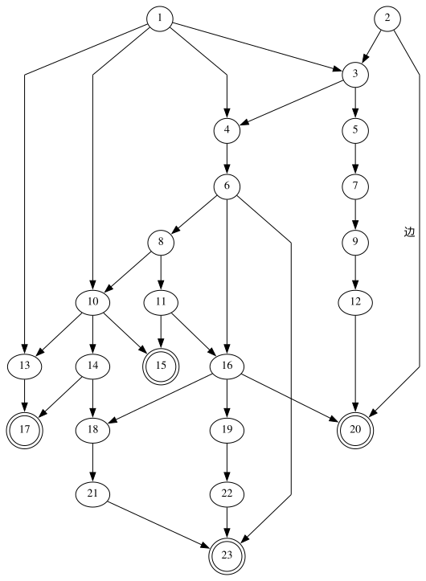
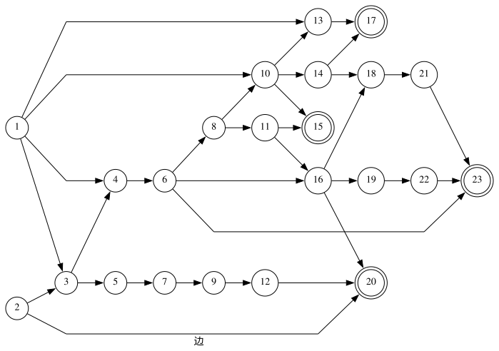
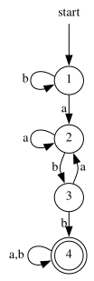
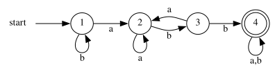

Graph Layout
============

[](https://github.com/CyberZHG/GraphLayout/actions/workflows/cpp-unit-test.yml)
[](https://github.com/CyberZHG/GraphLayout/actions/workflows/python-build-test.yml)
[](https://github.com/CyberZHG/GraphLayout/actions/workflows/wasm-build-test.yml)
[](https://github.com/CyberZHG/GraphLayout/actions/workflows/deploy-docs.yml)
[](https://pypi.org/project/sp-graph-layout/)
[](https://www.npmjs.com/package/sp-graph-layout)

A library for visualizing directed graphs. 

[Demo](./demo)

|         rank dir = TB          |         rank dir = LR          |
|:------------------------------:|:------------------------------:|
|  |  |
|  |  |

## Requirements

MacOS:

```bash
brew install cairo pango pkg-config
```

Linux:

```bash
sudo apt install libcairo2-dev libpango1.0-dev pkg-config
```

## Development

Add the following to CMake options to enable tests:

```bash
-DGRAPH_LAYOUT_ENABLE_TESTS=ON
```
